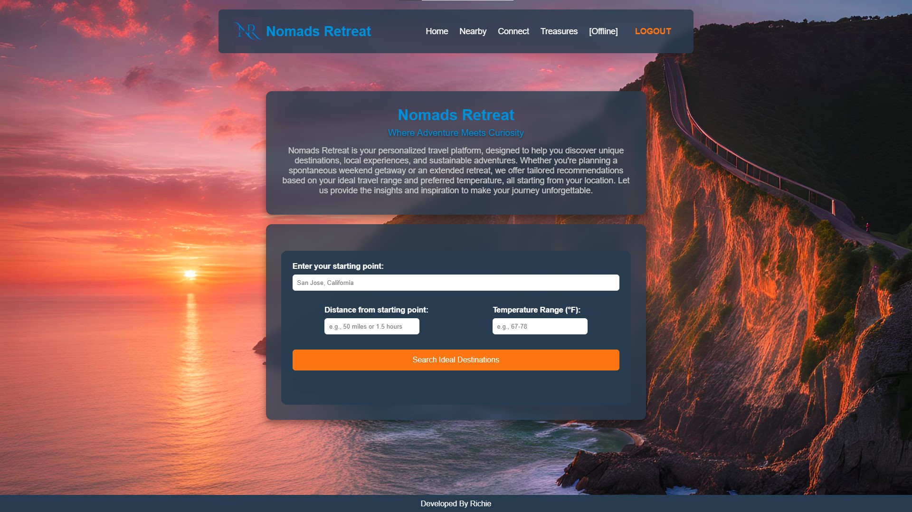

# Nomads Retreat

**Nomads Retreat** is a travel companion app designed to help you explore the world based on your preferences. It provides features like personalized destination filters, local experiences, offline access, and a vibrant social community to connect with fellow travelers.



## Features:
- **Personalized Destination Filters**: Search destinations based on weather, distance, and temperature preferences.
- **Points of Interest (POIs)**: Explore maps, reviews, restaurants, nightlife, and more.
- **Offline Access**: Premium members can access maps, itineraries, and emergency info offline.
- **Social Community**: Connect with other travelers through meet-ups, live chats, and travel buddy options.
- **Marketplace**: Buy, sell, and exchange travel gear in the Nomads Gypsy Treasures marketplace.
- **Radio Road/Weather Channel**: Listen to travel-related radio broadcasts for weather and road updates.

## Getting Started

To get started with **Nomads Retreat**, clone this repository and open `index.html` in your browser:

```website
https://website.com

Developed By Richie
Developed By UnknownBlackHat
Powered By Tornet Market
